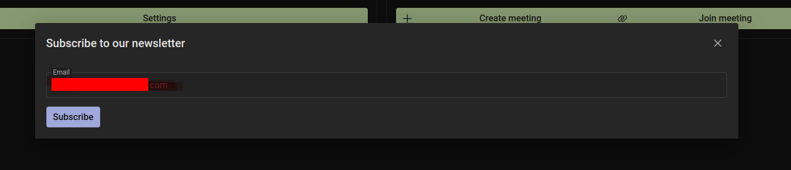

# Dr.Meetings
## About
This is a meeting app for the people who want to meet virtually. It has a simple interface and easy to use. It allows users to create a meeting and invite other users to join the meeting. The application is accessible from various platforms like web, mobile and desktop.
To use the application, you need to register an account. Users are encouraged to pay for subscription plan to be able to create a meeting by themselves. The subscription plan's price depends on how many users are going to join the meeting.
---
## UX
The website is created to be accessible to all users. The website is designed to be easy to use and intuitive. The navigation is simple to understand and easy to use. The background of the app is consistent with the design and aimed at keeping the user's attention on the app.
---

## User stories

### First time visitor

- As a first time visitor, I want to be able to see an informative page about the application, so that I can understand what it is about.
- As a first time visitor, I want to be able to see a list of all pricing plans, so that I can choose one.
- As a first time visitor, I want to be able to see a list of all available payment methods, so that I can choose one.
- As a first time visitor, I want to be able to easily navigate through the application, so that I can find what I am looking for.
- As a first time visitor, I want to be able to register, so that I can have an account.
- As a first time visitor, I want to be able to login, so that I can access my account.

### Registered user

- As a registered user, I want to be able to see my account information, so that I can update my information.
- As a registered user, I want to be able to see my account history, so that I can see what I have paid for.
- As a registered user, I want to be able to see what type of plan I have, so that I can find out what features are available.
- As a registered user, I want to be able to see when my plan will expire, so that I can know when I need to renew.
- As a registered user, I want to be able to create meetings, so that I can invite other users to join me.
- As a registered user, I want to be able to set up a password for a meeting, so only people I invite can join.
- As a registered user, I want to be able to join a meeting I have been invited to, so that I can join the meeting.
- As a registered user, I want to be able to leave a meeting, so that I can leave the meeting.
- As a registered user, I want to be able to change settings, so that I can change camera and microphone settings.
- As a registered user, I want to be able to change my password, so that I can protect my account.
- As a registered user, I want to be able to logout, so that I can logout of my account.
- As a registered user, I want to be able to delete my account, so that I can delete my account.
- As a registered user, I want to be able to upgrade my plan, so that I can have a better plan.
- As a registered user, I want to be able to mute or unmute my microphone, so that other users can or cannot hear me.
- As a registered user, I want to be able to turn of or turn on my camera, so that other users can or cannot see me.
- As a registered user, I want to be able to control cameras and microphones of other users, so that I can control them in a meeting I created.

---
## Business model
The Business Model is B2C, meaning that the company sells products (subscriptions) to customers only.
It focuses on individual transactions only at the moment.
### Target audience
Dr.Meetings is aimed at the diverse population. The target audience is the people who want to meet virtually. It includes friends who simply want to meet when it is temporarily not allowed, colleges who are living in remote areas and have to discuss some urgent matters, and even students who are want to organize a study group.
It excludes people who are younger than 13 years old.
### Strategy Trade-Off
The strategy trade-off is to make the application as user friendly as possible.
- simple interface;
- easy to use;
- intuitive navigation;
- consistent design;
- accessible to all users;
- free access to all users in the world to join the meeting.
- Low cost of the subscription plan.
- Security of the application.
- Tech support.

---
## Web Marketing
1. facebook
Having a page on facebook is a great way to get people to join the meeting on Dr.Meetings. Facebook has millions of users and is a great way to get people to become members of the Dr.Meetings community, it may easily lure new customers and increase the number of members who are purchasing the subscription plans.
[Facebook mockup](documentation/design/drmeeting_fb.pdf)
2. Newsletter
The newsletter subscription is a great way to deliver the latest news and updates to the users and subscribers.

---

## Future Development
​
1. Add chat functionality;
​
Chat functionality is essential for the future development of the application as it will help users to communicate with each other if there are any issues with the Internet connection or if there is a language barrier between the users.
​
2. Remove person from the meeting;
​
This feature will be added in the future development of the application as the meeting creator will definitely want to control the people who are in the meeting.
​
3. Organization functionality;
​
It would be nice to widen the scope of the application to include functionality for organizations to register and arrange their own private meetings.
​
---

## Technologies used
- ### Languages:
    
    + [Python 3.10.4](https://www.python.org/downloads/release/python-385/): the primary language used to develop the server-side of the website.
    + [JS](https://www.javascript.com/): the primary language used to develop interactive components of the website.
    + [HTML](https://developer.mozilla.org/en-US/docs/Web/HTML): the markup language used to create the website.
    + [CSS](https://developer.mozilla.org/en-US/docs/Web/css): the styling language used to style the website.
​
- ### Frameworks and libraries:
​
    + [Django](https://www.djangoproject.com/): python framework used to create all the logic.
    + [Django-rest-framework](https://www.django-rest-framework.org/): python framework used to create the API.
    + [React](https://reactjs.org/): javascript framework used to create the front-end of the website.
    + [PrimeReact](https://www.primefaces.org/primereact/): a set of components used to create the front-end of the website.
    + [Primeflex](https://www.primefaces.org/primeflex/): css framework used to style the front-end of the website.

- ### Databases:
​
    + [SQLite](https://www.sqlite.org/): was used as a development database.
    + [PostgreSQL](https://www.postgresql.org/): the database used to store all the data.
​
- ### Other tools:

    + [Git](https://git-scm.com/): the version control system used to manage the code.
    + [Pip3](https://pypi.org/project/pip/): the package manager used to install the dependencies.
    + [Psycopg2](https://www.python.org/dev/peps/pep-0249/): the database driver used to connect to the database.
    + [Heroku](https://dashboard.heroku.com/): the hosting service used to host the website.
    + [GitHub](https://github.com/): used to host the website's source code.
    + [VSCode](https://code.visualstudio.com/): the IDE used to develop the website.
    + [Chrome DevTools](https://developer.chrome.com/docs/devtools/open/): was used to debug the website.
    + [React DevTools](https://chrome.google.com/webstore/detail/react-developer-tools/fmkadmapgofadopljbjfkapdkoienihi): was used to debug the website.
    + [W3C Validator](https://validator.w3.org/): was used to validate HTML5 code for the website.
    + [W3C CSS validator](https://jigsaw.w3.org/css-validator/): was used to validate CSS code for the website.
    + [JShint](https://jshint.com/): was used to validate JS code for the website.
    + [PEP8](https://pep8.org/): was used to validate Python code for the website.
    + [Django-Countries](https://django-countries.readthedocs.io/en/latest/): was used to create the country list.
    + [stripe](https://stripe.com/): was used to create the payment system.
    + [Sitemap Generator](https://www.xml-sitemaps.com/) was used to create the sitemap.xml file.
    + [Privacy Policy Generator](https://www.privacypolicygenerator.info/) was used to create the privacy policy.
    + [Terms of Use Generator](https://www.termsofusegenerator.net/) was used to create the terms of use.

---
​
## Features
​
### Navbar:
​
There are 2 types of the navbar:
​
1. Navbar for logged out users:
​

​
  - "Home" button: takes the user to the home page.
  - "Pricing" button: takes the user to the pricing page.
  - "Contact" button: takes the user to the contact form page.
  - "Login" button: takes the user to the login page.
  - "Register" button: takes the user to the register page.

2. Navbar for logged in users:
​

​
  - It has a profile button. If user clicks this button, the user will see a sidebar with the user's profile information:
​
    
​
    It also has 3 buttons:
​
    - "Home" button: takes the user to the home page.
    - "Profile" button: takes the user to the profile page.
    - "Settings" button: takes the user to the settings page.
​
  **Note:** If user bought a subscription, there will be an additional button "Create Meeting" in the sidebar.
​
  
​
  - "Home" button: takes the user to the User's home page. If user is already on the his/her home page, the button will not be displayed.
​
    
​
  - "Logout" button: logs the user out.

### Footer:
​

​
It has a logo, email, phone number. It also has the following links:
​
- "Contact" button: takes the user to the contact form page;
- "Terms of use" button: takes the user to the terms of use page;
- "Privacy policy" button: takes the user to the privacy policy page;
- "Newsletter" button: opens modal form with the newsletter form;
​
  
​
  - If the user has already subscribed to the newsletter, the "Newsletter" form will show an error message.
​
    
​
  - When the user subscribes to the newsletter, the user will receive an email with a confirmation message.
​
  
​
  - If user clicks " unsubscribe" link in thee email, the user will be unsubscribed from the newsletter
​
   
​
- Social media icons (Facebook, Twitter, Instagram, LinkedIn): takes the user to the social media pages.

### Home page

This is the home page of the website. It has the description of the website and calls to action to get people to join the Dr.Meeting community.

It includes the following features:

2. Hero section:

It has a content on the left side and a background image on the right side.

It includes the call to action: "Absolutely new level of cloud meetings. Our platform is the best way to manage your meetings and video calls.". It also has 2 buttons:

- "Learn More" button: takes the user to the benefits section of the home page;
- "Get Started" button: takes the user to the register page.

3. Benefits section:

This section describes the benefits of choosing this platform over other platforms.

  - Built for Everyone;
  - End-to-End Encryption;
  - Easy to use;
  - Fast & Global support;
  - Open source;
  - Trusted security;

4. Get started section:

This section has a call to action to get people to join the Dr.Meeting community and a buttons:

  - "See pricing" button: takes the user to the pricing page;

### Pricing page

**When the user is logged out.**

It has the same navbar and footer as a Home page.

It has a title and 3 pricing plans' cards, which include full information about the plans and a "Buy Now" button.

1. Basic plan:

2. Premium plan:

3. Enterprise plan:

If the user is not logged in, the user will see a alert message to register/login first.

Under the pricing cards there is a call to action to get people to join the Dr.Meeting community and a buttons:

**When the user is logged in:**

When the user clicks "Buy Now" button, the user is taken to the payment page

### Payment page

Payment page is generated by the Stripe Checkout API. Here the user can enter his/her contact and credit card information. The use of Stripe Checkout makes it easy for the user to pay for the subscription and proofs that only Stripe gets the credit card information and not my website. 

After successful payment, the user is taken to the Home page.

### Successful payment emails

After successful payment, the user is taken to the Home page. User will see the message notifying him/her that the payment was successful.

User will also receive an email with the created subscription.

And the following email will be also sent to the user about the payment:

The money will be payed to the Dr.Meeting account automatically each month and the user will will be sent the same email each month till the user cancels the subscription.

User can also download the invoice for the payment.

[Successful payment invoice](documentation/features/Invoice-B1447E8F-0009.pdf)

If the payment is not successful, the user will receive an email with the error message and the link to the stripe customer portal.

### User dashboard

It has 4 cards:

1. Profile card:

This card has a User name, User email, and a button "Profile page". If the user clicks this button, the user will be redirected to the profile page.

2. Pricing card:

It has subscription plan and the description of functionality according to the plan.

It also has a button "See pricing" that takes the user to the pricing page.

If user has purchased a subscription plan, this card will look different.

If user clicks "See subscription" button, the user will be redirected to the subscription page.

3. Settings card:

It has a data on the current camera and microphone settings. There is a button "Settings" that takes the user to the settings page.

4. Meetings card:

It has short description of the meeting's card and 2 buttons:

  - "Create meeting" button: takes the user to the create meeting page. *This button is disabled if the user is using free plan.*
  - "Join meeting" button: takes the user to the join meeting page. When the user clicks this button, the user will see a modal window with an input field to enter the meeting's token:

    

    If the user enters a valid token, the user will be redirected to the meeting page.

If the user has purchased a subscription plan, this card will look differently:

  When the user clicks "Create Meeting" button, user will be redirected to Create meeting page.

### Create meeting page

If user bought enterprise plan, this page will have all 3 options for Max guests.

If user bought premium plan, this page will have only 2 options for Max guests (11 guests buttons will be disabled).

If user bought basic plan, this page will have only 1 option for Max guests ( 8 and 9 guests buttons will be disabled).

If the user without a subscription plan comes to this page by directly typing the URL, the page will be redirected to the home page and an alert message will be shown.

### Edit Profile page

This page has a form to edit the user's profile. The user can edit his first name, last name, birthday, country, password, and avatar. After clicking "Save" button, the user will be redirected to the user dashboard.

### Settings page

This page allows user to set the camera and microphone settings.

When user click select camera, the user will see a select options:

When the camera is selected, the user will see a preview of the camera.

When user click select microphone, the user will see a select options:

When the microphone is selected, the user will see a knob that shows the volume of the microphone.

When user click "Save" button, the settings will be saved.

As it is shown in the screenshots, the user will be able to see chosen camera and microphone in different color:

### Subscription page

This page has a data on the current subscription plan and provides data on the future payments.

It has 3 buttons:

- History button: opens a modal window with the history of the payments.

- Portal button: stripe customer portal for the user to manage his payments.

- Cancel button: to cancel subscription.

When the order is cancelled, the user will receive an email with a confirmation message and the money will be refunded.

### Register page

This page has the following fields:

- first name;
- last name;
- Email;
- Password;
- Confirm password;
- Birthday;
- Country;

It has a checkbox in order to confirm that the user agreed to the terms and a register button;

If user has already created account before, he/ she can use "Already have an account? Login" link to redirect to Login page.

When the user registers, the user will receive an email with a confirmation message.

### Login page

This form has 2 fields:

- User email;
- Password;

Login button and a link to register page and forgot password page. When user clicks "Register" link, he or she will be redirected to Register page. If user clicks "Forgot Password", he or she will be redirected to forgot password page.

When the user attempts to change the password, the user will receive an alert email to warn him/ her about the security:

