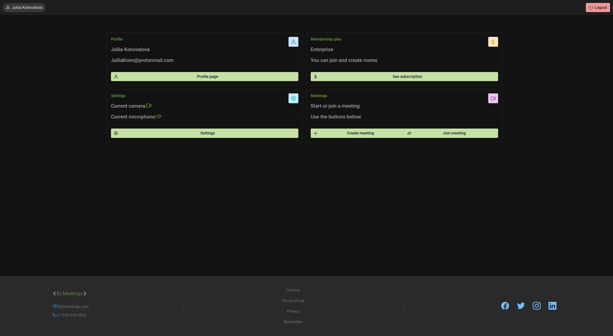
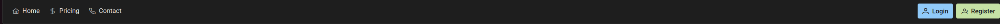
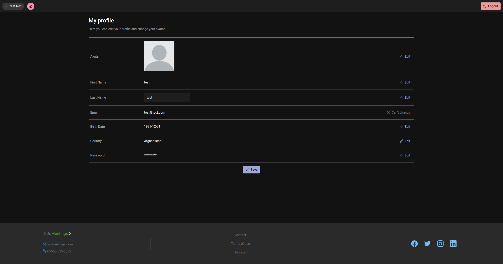
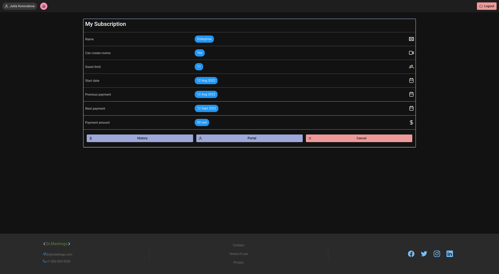
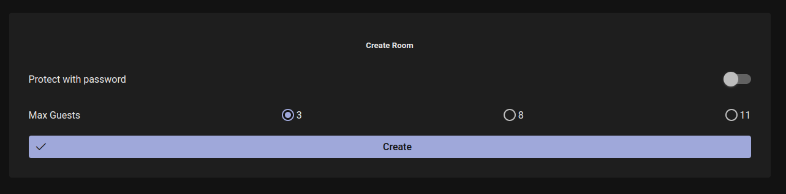

# TESTING

## Manual Testing

Testing was done throughout site development, for each feature before it was merged into the master file.

Usability was tested with the below user acceptance testing to ensure testing from different users, on different devices and browsers to ensure issues were caught and where possible fixed during development. However, it was noticed that in Chinese browsers (Breeno, QQ, etc) there was some difficulty with the testing, as the browser would not be able to display React components correctly.

| Page    | User Actions           | Expected Results | Y/N | Comments    |
|-------------|------------------------|------------------|------|-------------|
| Sign Up     |                        |                  |      |             |
| 1 | Click Register button in nav bar | Redirect to register page | Y   |             |
| 2 | Click login in "Already have an account?" section | Redirect to login page | Y   |             |
| 3 | Click login in "Don't have an account?" section | Redirect to login page | Y   |             |
| 4 | Fill in all fields in the register page | Successfully register, email notification, redirect to login | Y   |             |
| Login      |                        |                  |      |             |
| 1 | Click Login button in nav bar | Redirect to login page | Y   |             |
| 2 | Fill in all fields in the login page | Successfully login, redirect to home page | Y   |             |
| 3 | Click logout in nav bar | Redirect to login page | Y   |             |
| 4 | Click forgot password in nav bar | Redirect to forgot password page | Y   |             |
| 5 | Fill in all fields in the forgot password page | Alert email be sent, and email with confirmation link, redirect to login page | Y   |             |
| 6 | User confirms link in email | Redirect to reset password page | Y   |             |
| Navbar |                        |                  |      |             |
| 1 | Click home in nav bar | Redirect to home page | Y   |             |
| 2 | Click pricing in nav bar | Redirect to pricing page | Y   |             |
| 3 | Click contact in nav bar | Redirect to contact form page | Y   |             |
| 4 | Click login in nav bar | Redirect to login page | Y   |             |
| 5 | Click register in nav bar | Redirect to register page | Y   |             |
| Navbar for logged in users |                        |                  |      |             |
| 1 | Click profile with user's name buttons | Sidebar with user's profile | Y   |             |
| 2 | Click logout in nav bar | Redirect to login page | Y   |             |
| Sidebar |                        |                  |      |             |
| 1 | Click home in sidebar | Redirect to user's dashboard home page | Y   |             |
| 2 | Click profile in sidebar | Redirect to user's profile page | Y   |             |
| 3 | click settings in sidebar | Redirect to user's settings page | Y   |             |
| 4 | Click Create room in sidebar | Redirect to create room page | Y   | This button is visible only to users who have purchased a subscription |
| Footer |                        |                  |      |             |
| 1 | Click email in footer | Opens an email client | Y   |             |
| 2 | Click phone in footer | Opens a phone client | Y   |             |
| 3 | Click contact in footer | Opens a contact form | Y   |             |
| 4 | Click Terms of Use in footer | Opens a Terms of Use page | Y   |             |
| 5 | Click Privacy Policy in footer | Opens a Privacy Policy page | Y   |             |
| 6 | Click on Facebook icon in footer | Opens a Facebook page | Y   |             |
| 7 | Click on Twitter icon in footer | Opens a Twitter page | Y   |             |
| 8 | Click on Instagram icon in footer | Opens a Instagram page | Y   |             |
| 9 | Click on LinkedIn icon in footer | Opens a LinkedIn page | Y   |             |
| 10 | Click on Newsletter in footer | Opens a Newsletter form | Y   | If user logged in, user's email is pre-filled. If user has already subscribed, user is alerted that they have already subscribed. If user subscribes, He/she will receive an email confirmation. |
| Home       |                        |                  |      |             |
| 1 | Click Learn more in the hero section | Scroll to the benefits section | Y   |             |
| 2 | Click Get Started button in the hero section | Redirect to get started page | Y   |             |
| 4 | Click See Pricing button in the hero section | Redirect to pricing page | Y   |             |
| Pricing |                        |                  |      |             |
| 1 | Click Buy now in Basic plan card | Redirect to stripe checkout page | Y   |             |
| 2 | Click Buy now in Premium plan card | Redirect to stripe checkout page | Y   |             |
| 3 | Click Buy now in Enterprise plan card | Redirect to stripe checkout page | Y   |             |
| 4 | Click Register button in the pricing page | Redirect to register page | Y   | If user logged in, this buttons does not appear |
| User Dashboard |                        |                  |      |             |
| 1 | Click on profile page in the dashboard | Redirect to user's profile page | Y   | where user can edit profile             |
| 2 | Click on settings page in the dashboard | Redirect to user's settings page | Y   | where user can edit settings             |
| 3 | Click on see subscriptions page in the dashboard | Redirect to user's subscriptions page | Y   | where user can see subscriptions             |
| 4 | Click on create meeting page in the dashboard | Redirect to create meeting page | Y   | This button is unable only if the user bought a subscription             |
| 5 | Click on the Join meeting in the dashboard | Modal window appears where the user can input the token to be allowed to join the meeting | Y   |             |
| Profile |                        |                  |      |             |
| 1 | Click on the edit button near avatar | "Choose" button will replace avatar | Y   |             |
| 2 | Click on the "Choose" avatar button | Opens a file explorer to select an avatar | Y   |             |
| 3 | Select an avatar from the file explorer | Avatar is replaced | Y   |             |
| 4 | Click on the edit button near First name | The existing First name will be replaced with the input which has a placeholder text with the existing First name | Y   |             |
| 5 | Click on the edit button near Last name | The existing Last name will be replaced with the input which has a placeholder text with the existing Last name | Y   |             |
| 6 | Click on the edit button near Birthday | The existing Birthday will be replaced with the input which has a placeholder text with the existing Birthday | Y   |             |
| 7 | Click on the edit button near country | The existing country will be replaced with the input which has a placeholder text with the existing country | Y   |             |
| 8 | Click on the edit button near password | The existing password will be replaced with the input which has a placeholder text with the existing password | Y   |             |
| 9 | Click on the save button | User's profile is updated | Y   |             |
| Settings |                        |                  |      |             |
| 1 | click on choose camera select | All existing cameras are displayed in select | Y   |             |
| 2 | click on camera in select options | The user will be able to see the preview of the camera | Y   | If user goes to the select camera again, the chosen camera will be emphasized  with light purple color |
| 3 | click on choose microphone select | All existing microphones are displayed in select | Y   |             |
| 4 | click on microphone in select options | The user will be able to see the knob of the microphone | Y   | If user goes to the select microphone again, the chosen microphone will be emphasized  with light purple color |
| See subscriptions |                        |                  |      |             |
| 1 | Click History button in the subscriptions page | dropdown with history data is displayed | Y   |             |
| 2 | click Portal button in the subscriptions page | Redirect to stripe customer portal page to view full data | Y   |             |
| 3 | click on the cancel button in the subscriptions page | Modal window appears where the user can cancel the subscription | Y   |             |
| 4 | click on no button in the subscription cancel modal | Modal window is closed | Y   |             |
| 5 | click on yes button in the subscription cancel modal | Subscription is canceled, the user gets refunded, and email confirmation | Y   |             |
| Create meeting |                        |                  |      |             |
| 1 | Click on protect with a password switch | Password input field appears | Y   |             |
| 2 | Type in password in the password input field | Password input is filled with password asterisks | Y   |             |
| 3 | Click on view password button | Asterisks are replaced with the actual password | Y   |             |
| 4 | Select maximum number of participants in radio buttons | Maximum number of participants is saved | Y   |   The number of active radio buttons depends on the type of subscription the user has |
| 5 | Click on create button | Meeting is created, and user redirected to meeting page | Y   |             |
| Meeting |                        |                  |      |             |
| 1 | Click on the room token in the meeting page | token will be copied and the user sees a message that token is copied | Y   |             |
| 2 | Click camera control in the meeting page | If camera was turned on, the camera will be turned off. If camera was turned off, the camera will be turned on | Y   |             |
| 3 | Click microphone control in the meeting page | If microphone was turned on, the microphone will be turned off. If microphone was turned off, the microphone will be turned on | Y   |             |
| 4 | Click on mute guests control button in the meeting page | If guests were muted, the guests will be unmuted. If guests were unmuted, the guests will be muted | Y   |  Available only if the user has created this room |
| 5 | Click on delete room button in the meeting page | Room will be deleted and all participants will be kicked | Y   |  Available only if the user has created this room |
| 6 | Click on leave room button in the meeting page | User will be redirected to dashboard | Y   |  Available only if the user is a guest of this room |
| 7 | Click on fullscreen button in the meeting page | Meeting is fullscreened | Y   |  Performance can depend on the browser |

## Testing User Stories

| First Time Visitor Goals | Requirement met | Image |
| ------------------------- | --------------- | ----- |
| As a first time visitor, I want to be able to see an informative page about the application, so that I can understand what it is about. | Y   |  |
| As a first time visitor, I want to be able to see a list of all pricing plans, so that I can choose one. | Y   |  |
| As a first time visitor, I want to be able to easily navigate through the application, so that I can find what I am looking for. | Y   |   |
| As a first time visitor, I want to be able to register, so that I can have an account. | Y   |  |
| As a first time visitor, I want to be able to login, so that I can access my account. | Y   |  |

| Registered user Goals | Requirement met | Image |
| --------------------- | --------------- | ----- |
| As a registered user, I want to be able to see my account information, so that I can update my information. | Y   |    |
| As a registered user, I want to be able to see my payment history, so that I can see what I have paid for. | Y   |  |
| As a registered user, I want to be able to see what type of plan I have, so that I can find out what features are available. | Y   |  |
| As a registered user, I want to be able to see when my plan will expire, so that I can know when I need to renew. | Y   |  |
| As a registered user, I want to be able to create meetings, so that I can invite other users to join me. As a registered user, I want to be able to set up a password for a meeting, so only people I invite can join.| Y   |  |
| As a registered user, I want to be able to join a meeting I have been invited to, so that I can join the meeting. | Y   |  |
| As a registered user, I want to be able to leave a meeting, so that I can leave the meeting. | Y   |  |
| As a registered user, I want to be able to change settings, so that I can change camera and microphone settings. | Y   |  |
| As a registered user, I want to be able to change my password, so that I can protect my account. | Y   |  |
| As a registered user, I want to be able to logout, so that I can logout of my account. | Y   |  |
| As a registered user, I want to be able to mute or unmute my microphone, so that other users can or cannot hear me. | Y   |  |
| As a registered user, I want to be able to turn off or turn on my camera, so that other users can or cannot see me. | Y   |   |
| As a registered user, I want to be able to control microphones of other users, so that I can control them in a meeting I created. | Y   |    |